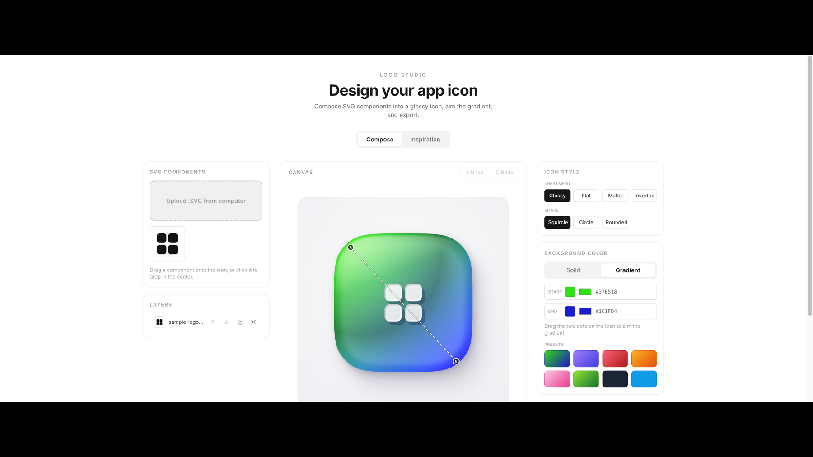
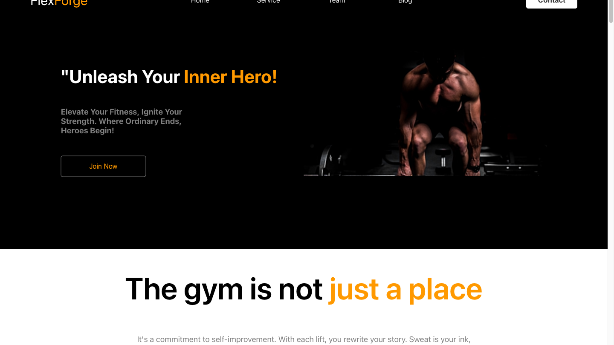

# Adeeb Hoque

I design and build web products end-to-end — SaaS, client sites, and tools.

### Selected work

<table>
  <tr>
    <td width="50%" valign="top">
      
      <b>Logo Studio</b> 
      Compositional SVG logo design tool — layers, gradients, icon search, exports. 
      <a href="https://github.com/Adeeb-Hoque/logo-studio">Repo</a> · <a href="https://adeeb-hoque.github.io/logo-studio/">Live demo</a>
    </td>
    <td width="50%" valign="top">
      
      <b>FlexForge</b> 
      Brand site and content system for a fitness brand. 
      <a href="https://flexforge.fit">Live</a>
    </td>
  </tr>
</table>

TypeScript · React · Next.js · Python · Tailwind
